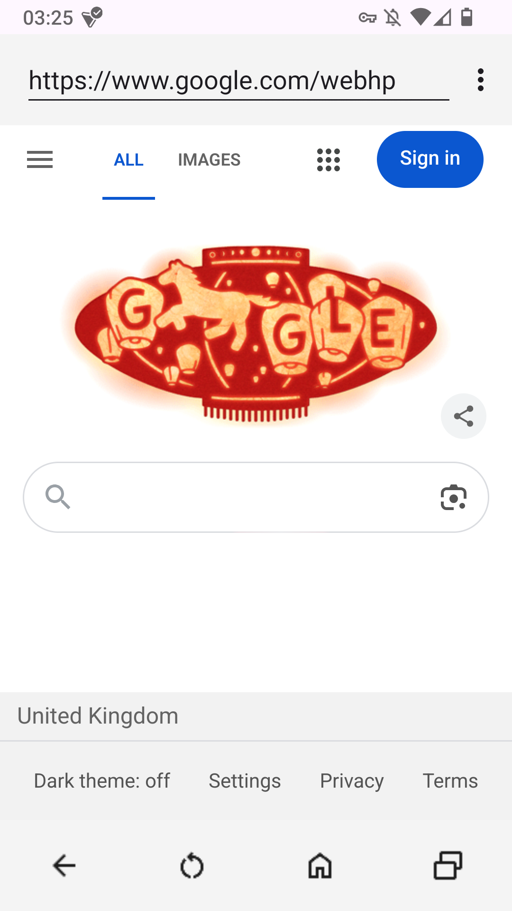
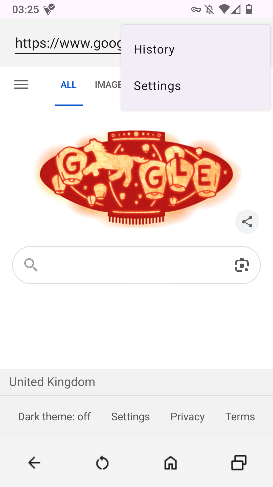
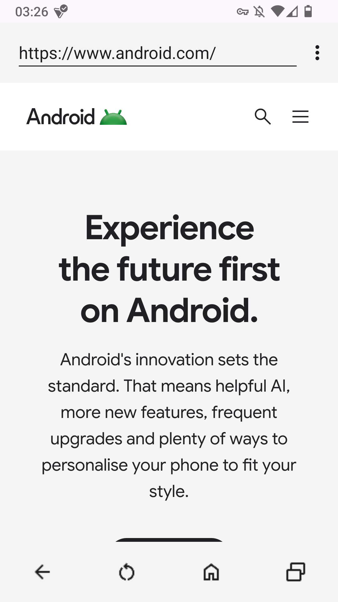
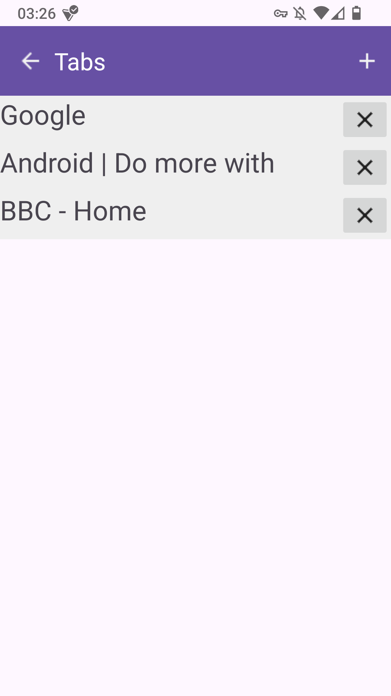
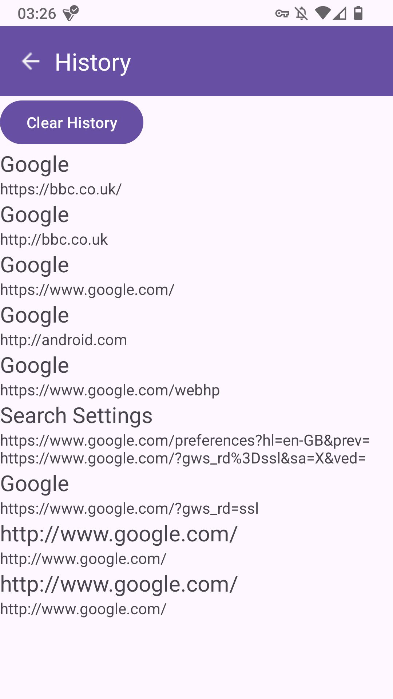
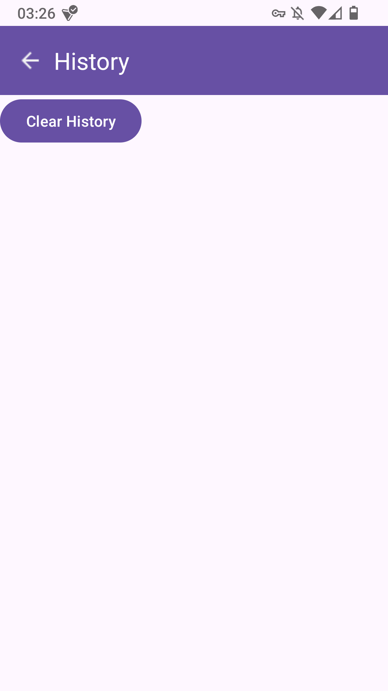
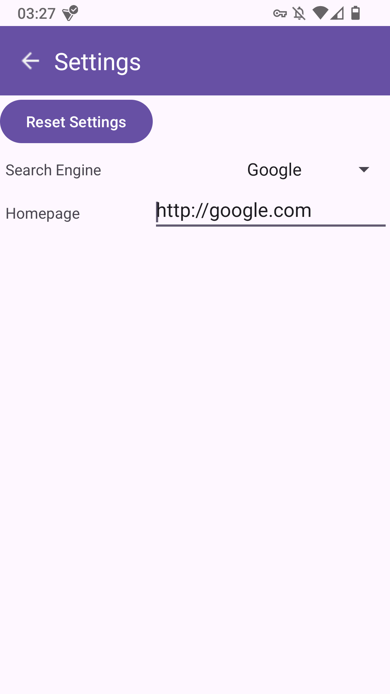
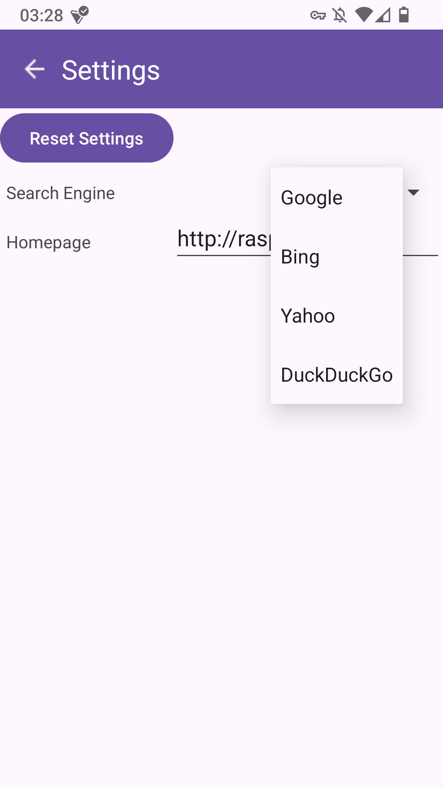
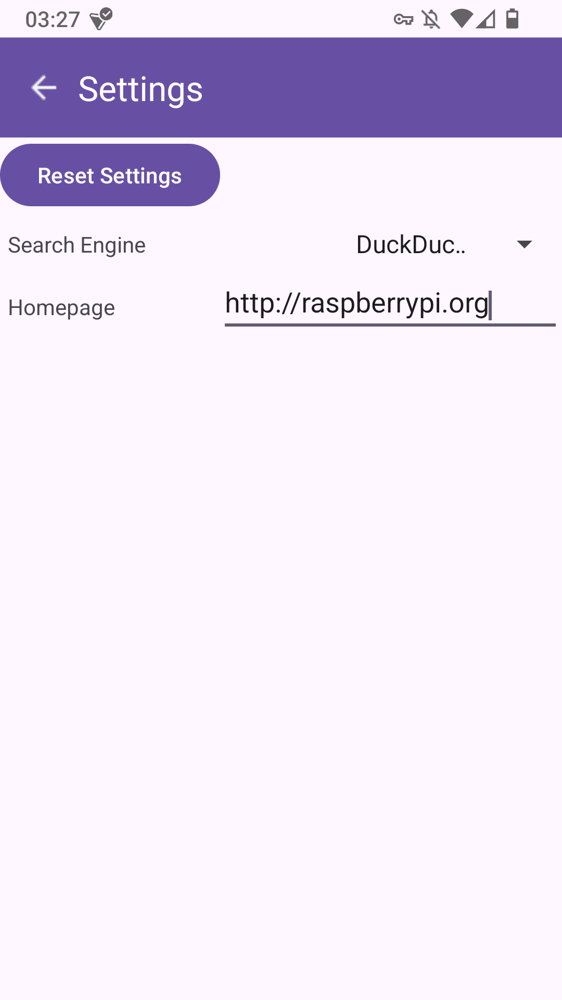

# SeaSurf

Web browser for Android using Mozilla's GeckoView.

## Introduction

SeaSurf is a multi-tabbed, lightweight, and open-source web browser for Android versions 6.0 (SDK 23) and newer.

### Features
- Back, Refresh, and Home buttons
- Constantly-updating Address Bar for navigating to websites and searching
- Multiple tabs: the ability to add, switch, and close tabs
- Browser history sorted from most recent, with the ability to clear
- Set a search engine with choices of Google, Bing, Yahoo, and DuckDuckGo; and set a homepage
- Downloading external files using Android's DownloadManager service

All icons used in SeaSurf are from [Google Fonts](https://fonts.google.com/icons).

### Dependencies

SeaSurf requires Android version 6.0 or later installed on the device.

It also uses Mozilla's GeckoView browser engine which should be included in the gradle files and should be downloaded when the project is synced.

## Design

During the design of SeaSurf, I wanted a web browser that would have the navigation buttons (back, forward, refresh, home) at the bottom of the screen and the address bar at the top with some sort of options menu.

When implementing, I decided to separate the functionality of the app into four different activities:

1. Main activity, which includes the actual browser component with the navigation buttons, address bar, and webview.
2. Tabs activity, which lists the tabs open and buttons to create a new tab and close existing ones.
3. History activity, which lists all pages previously visited alongside a button to clear history.
4. Settings activity, which displays the currently selected search engine and homepage and lets the user change them.

I decided not to use fragments for the app as they would be all part of the same activity and I thought I would have more freedom to design the menus differently and not have to worry about components interfering with one another.

### Main

<figure>
    
    <figcaption>Main Activity</figcaption>
</figure>

For the main activity, the layout of the activity is a vertical `LinearLayout` containing two horizontal `LinearLayout` for the top and bottom toolbars respectively; and `GeckoView` filling the rest of the activity. `LinearLayout` was most suited for the task as I could order components on top of or next to one another easily.

I decided to use Toolbars for the navigation bars in addition as they have the option to enable an options menu and can be given a background colour that can distinguish them.

In the top navigation bar, I have used an `EditText` for the address bar so to allow the user to enter an address or search query. In `MainActivity.java`, I have set the top navigation bar as an action bar so it displays an options menu button. The options menu contains two buttons for History and Settings. Although originally, I also wanted to add Bookmarks and a Request Desktop Mode, I was constrained by time and had to abandon the idea.

<figure>
    
    <figcaption>Options Menu</figcaption>
</figure>

I opted for Mozilla's `GeckoView` implementation as opposed to the built-in, Chrome-based `WebView` because `GeckoView` is specifically designed for building browsers as opposed to `WebView` which is more intended for displaying web content in other apps. `GeckoView` relies on delegates for much of its functionality which I can write myself, for example when the URL is changed I want to be able to handle that myself so I can update the address bar.

<figure>
    
    <figcaption>Android website in SeaSurf</figcaption>
</figure>

### Tabs

<figure>
    
    <figcaption>Tabs Activity</figcaption>
</figure>

When the tabs button is clicked in the main activity, the browser will use an intent to create a new tabs activity and switch to it.

For the tabs activity, I used a `RecyclerView` to list each tab as a custom layout containing the title of the page open in the tab alongside a close button. 

Additionally, I also added a back button and new tab button to the toolbar of the activity, the former for user-friendliness and the latter to create a new tab. 

When a new tab is created, the browser will switch to that tab and exit the tabs activity back to the main activity. If any item in the `RecyclerView` is clicked, the browser will also change to that tab and exit the tabs activity.

The `Tab` class stores the `GeckoSession` of each tab alongside its individual history, URL, and current page title alongside static functions for switching tabs, creating new tabs, and accessing the current tabs. Although I originally made a handler class for the webview as a whole, I realised after implementing tabs it would be more simple to just be able to access the current tab as an object as each tab has its own `GeckoSession`.

When the URL changes in the tab currently in use, I used a custom event, `URLChangedEvent`, to notify my address bar to set it to the new URL. This event is also fired when changing between tabs so the address bar updates to the new tab's URL.

### History

<figure>
    
    <figcaption>History Activity</figcaption>
</figure>

The History activity is accessed through the History option in the Main Activity options menu.

Similar to Tabs, the History activity displays a back button in the toolbar and uses a `RecyclerView` for displaying each entry. The purpose of this activity is to display all past pages the user has visited in the browser. The history item layout includes both the title of the page and its URL, and the items are sorted in order of most recent first.

The activity also includes a clear button, so the user can clear their browsing history. Unfortunately, due to a lack of time, I was unable to implement the option to choose a range of time, e.g. the last day to delete the history for so the button will just erase the entire history.

<figure>
    
    <figcaption>History after clearing</figcaption>
</figure>

To store browsing history, the browser makes use of the SQLite implementation for Android which I simplified into a class called `HistoryDbHelper` which includes functions for creating the `History` table for storing browsing history, obtaining all entries, and clearing the table.

If an entry in the history `RecyclerView` is clicked, the activity will send an `Intent` containing the URL of the entry to the main activity and then close. The main activity will then handle this intent by 

### Settings

<figure>
    
    <figcaption>Settings Activity</figcaption>
</figure>

The Settings activity, like History, is accessed with its respective option in the options menu.

There are currently two settings which are both set through `SharedPreferences`: the search engine and homepage. The `Preferences` class serves as a handler.

Search Engine is selected through a `Spinner` element and allows the user to select from four possible search engines: Google, Bing, Yahoo, DuckDuckGo. If the user is detected to have entered a search query in the address bar in Main Activity, this will determine which search engine handles the query. The default is Google.

<figure>
    
    <figcaption>Selecting search engine</figcaption>
</figure>

Homepage is entered through an `EditText` element and can be any page so long as it is a valid URL. If it is detected to be invalid it will be set to the default value of "https://google.com". The homepage is loaded on creating a new tab or clicking the home button in the navigation bar.

<figure>
    
    <figcaption>Custom search engine and homepage set</figcaption>
</figure>

The Settings Activity contains a reset button which sets the search engine and homepage to their default which is Google.

## Challenges and Future Improvements

During development of this app, my biggest challenge was probably implementation of the back button. Despite sounding so simple, and although `GeckoSession` has a `goBack` function, I needed to know what URL to put into the address bar. Unlike going to a URL normally, `goBack` does not trigger a load request and thus the navigation delegate I used to get the current URL and send an event to notify the address bar did not work. I ended up settling for a stack due to its last-in-first-out structure, which is ideal for the back button as you want the last visited page. However, this still sometimes gives an inaccurate URL when going back and often stores redirects, despite my best efforts to have it not.

I wanted to implement a context menu for when the user presses for long on a URL, which would include options to open link, open link in new tab, and copy link. However, despite the functionality for detecting a long press on a hyperlink being available in `GeckoSession`'s `ContentDelegate` interface, there was no obvious way to map the options in the context menu triggered by pressing on a link to functions, such as to open in a new tab, so I had to abandon the idea.

Originally, I was using a custom wrapper for `GeckoView` and storing tabs in an `ArrayList` of `GeckoSession`, however I discovered that I could not easily pass the `ArrayList` to the tab activity due to its custom data type not being supported by the `putExtra` function of the `Intent` object. Therefore, I decided to transition to a `Tab` class with a static function to get all instances, which I could call directly from the tab activity.

In future versions of the app, I would like to implement bookmarks which would be stored with SQLite similar to history. I would also like to add a desktop mode which would spoof the user agent of a desktop browser to websites thus showing the desktop version.

Additionally, I would like to add more settings including themes and anti-tracking features, display times and dates on entries in the history activity, and the option to choose certain time ranges when clearing history.
